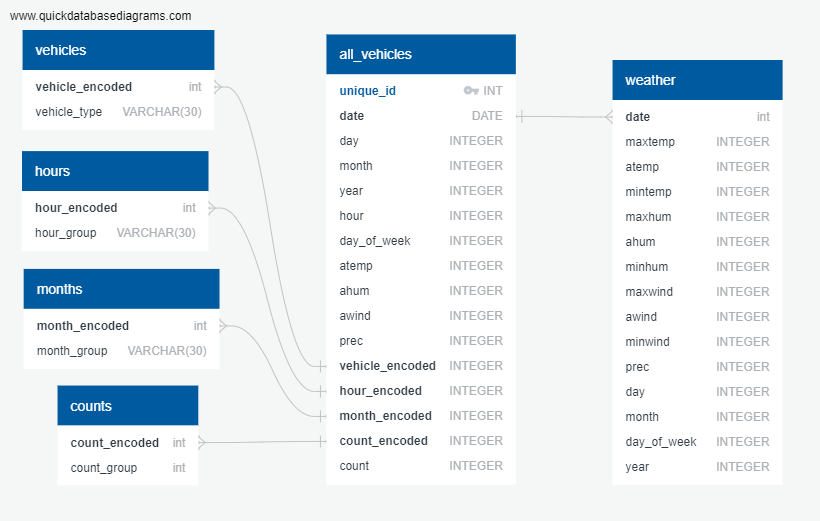

# Austin-Transporation-Alternatives

This repo contains:
1. Several Jupyter Notebooks to clean, assess, and load data to a local Postgres database; 
2. The SQL statements required to create tables in a Postgres database;
3. A Flask app which accesses the Postgres database to return results.

# Project Proposal/Outline

There are over 15,500 dockless scooters and 2,500 bicycles in the city of Austin. These vehicles can be rented and rode within 
the bounds a company provides. This project analyzes the data behind the trips taken on these vehicles in combination with historical weather data. It then provides a Decision Tree Regression model which can be used to predict a range of demand for 
scooters or bicycles on a given day and time with 90% accuracy. 

# Project Presentation
The presentation can be viewed here:
https://docs.google.com/presentation/d/1Cxi_sE-L9v6SiM5DtS3tOglHEhsxOJUdqmgIBqXVMEs/edit?usp=sharing

# Data Sources
* https://www.wunderground.com/history/monthly/us/tx/austin/KAUS/
* https://data.austintexas.gov/Transportation-and-Mobility/Shared-Micromobility-Vehicle-Trips/7d8e-dm7r

# Data Model

# How to Set Up
1. Create a micromobility database in your local Postgres and use the `etl/sql statements.txt` to create the necessary columns and tables necessary. 
2. Run the `data/Data Cleanup.ipynb` notebook to clean up and combine the data. 
3. Run the `ML notebook.ipynb` notebook to run regressions and save the model. 
4. Run the `etl/ETL Notebook.ipynb` notebook to load the data into Postgres. 
5. Use `python app.py` to run the app and predict demand! 
